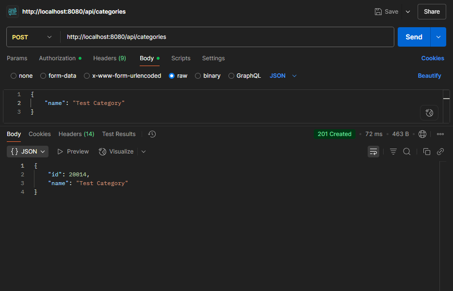

# Spring Commerce Application

## SOLUTION
- [x] Entity-relationship diagram 
  - 
- [x] Solution diagram 
  - 

## Software Development Principles, Patterns and Practices

### SOLID Principles
- **Single Responsibility Principle (SRP)**: Mỗi class chỉ có một nhiệm vụ duy nhất
  - Controllers xử lý HTTP requests
  - Services xử lý business logic
  - Repositories xử lý data access

- **Open/Closed Principle (OCP)**: Code mở rộng nhưng không sửa đổi
  - Sử dụng interfaces cho repositories và services
  - Dễ dàng thêm tính năng mới mà không ảnh hưởng code hiện tại

- **Liskov Substitution Principle (LSP)**: Các class con có thể thay thế class cha
  - UserDetailsImpl kế thừa từ UserDetails
  - Các entity kế thừa từ BaseEntity

- **Interface Segregation Principle (ISP)**: Interface nhỏ, tập trung
  - Mỗi repository interface chỉ định nghĩa các method cần thiết
  - Service interfaces được chia nhỏ theo chức năng

- **Dependency Inversion Principle (DIP)**: Phụ thuộc vào abstraction
  - Sử dụng dependency injection của Spring
  - Các dependency được inject thông qua constructor

### Design Patterns
- **MVC Pattern**:
  - Model: Entities, Repositories, Services
  - View: Frontend React components
  - Controller: REST Controllers

- **Repository Pattern**:
  - Tách biệt logic truy cập dữ liệu
  - JPA Repositories cho database operations

- **Service Layer Pattern**:
  - Business logic được đóng gói trong services
  - Transaction management
  - Data validation

- **DTO Pattern**:
  - Tách biệt entity và data transfer objects
  - Mapping giữa entity và DTO

## Code Structure

```
├── src/
│   ├── main/
│   │   ├── java/
│   │   │   └── com/
│   │   │       └── commerce/
│   │   │           ├── config/         # Configuration classes
│   │   │           ├── controller/     # REST Controllers
│   │   │           ├── dto/           # Data Transfer Objects
│   │   │           ├── entity/        # JPA Entities
│   │   │           ├── repository/    # JPA Repositories
│   │   │           ├── service/       # Business Logic
│   │   │           └── security/      # Security Configuration
│   │   └── resources/
│   │       ├── application.yml       # Application Configuration
│   │       └── static/              # Static Resources
├── frontend/
│   ├── src/
│   │   ├── components/    # React Components
│   │   ├── pages/        # Page Components
│   │   ├── services/     # API Services
│   │   └── types/        # TypeScript Types
└── pom.xml               # Maven Configuration
```

## Setup Instructions

1. **Prerequisites**
   - Java 17
   - Node.js 16+
   - Maven
   - SQL Server

2. **Backend Setup**
   ```bash
   # Clone repository
   git clone https://github.com/MaLuongKhanh/spring-commerce.git
   
   # Navigate to project directory
   cd spring-commerce
   
   # Build project
    mvn clean install

   # Run application
    mvn spring-boot:run
    ```

3. **Frontend Setup**
    ```bash
   # Navigate to frontend directory
   cd frontend
   
   # Install dependencies
   npm install
   
   # Start development server
   npm start
   ```

4. **Database Setup**
   - Create SQL Server database named 'commerce'
   - Update database credentials in `application.yml`
   - Run database migrations

## API Documentation

### Authentication APIs

| URL                          | METHOD | IMAGE                                                                     | DESCRIPTION                     |
| ---------------------------- | :----: | ------------------------------------------------------------------------- | ------------------------------- |
| `/api/auth/authenticate`     |  POST  |             | Login user                      |
| `/api/auth/register`        |  POST  |         | Register new user               |
| `/api/auth/refresh-token`   |  POST  |          | Refresh access token            |

### Product APIs

| URL                          | METHOD | IMAGE                                                                           | DESCRIPTION                              |
| ---------------------------- | :----: | ------------------------------------------------------------------------------- | ---------------------------------------- |
| `/api/products`              |  GET   |                  | Get all products                         |
| `/api/products/filter`       |  GET   |              | Filter products by criteria              |
| `/api/products`              |  POST  |                 | Create a new product                     |
| `/api/products/id`           |  GET   |               | Get product by ID                        |
| `/api/products/id`           |  PUT   |               | Update product by ID                     |
| `/api/products/id`           | DELETE |            | Delete product by ID                     |

### Order APIs

| URL                       | METHOD | IMAGE                                                                     | DESCRIPTION                     |
| ------------------------- | :----: | ------------------------------------------------------------------------- | ------------------------------- |
| `/api/orders`             |  GET   |              | Get all orders                  |
| `/api/orders`             |  POST  |             | Create a new order              |
| `/api/orders/id`          |  GET   |           | Get order by ID                 |
| `/api/orders/id/status`          |  PUT   |           | Update order status by ID              |
| `/api/orders/id`          | DELETE |        | Delete order by ID              |

### Category APIs

| URL                    | METHOD | IMAGE                                                                     | DESCRIPTION                     |
| ---------------------- | :----: | ------------------------------------------------------------------------- | ------------------------------- |
| `/api/categories`      |  GET   |         | Get all categories              |
| `/api/categories`      |  POST  |        | Create new category             |
| `/api/categories/id`   |  GET   |      | Get category by ID              |
| `/api/categories/id`   |  PUT   |      | Update category by ID           |
| `/api/categories/id`   | DELETE |   | Delete category by ID           |

### Comment APIs

| URL                          | METHOD | IMAGE                                                                     | DESCRIPTION                     |
| ---------------------------- | :----: | ------------------------------------------------------------------------- | ------------------------------- |
| `/api/comments/product/id`   |  GET   |           | Get comments for product        |
| `/api/comments/product/id/user/id` | POST |  | Add comment to product          |

## Screenshots

### Authentication
- 
- 

### Product 
- 
- 

### Shopping Cart
- 

### Order
- 
- 

### User Management
- 
- 

### Admin Management
- 
- 
- 
- 

## Security Implementation

### Spring Security Configuration
- JWT based authentication
- Role-based authorization
- Password encryption using BCrypt
- CORS configuration
- CSRF protection

### Security Features
- User registration and login
- Role-based access control (ADMIN, USER)
- JWT token generation and validation
- Password encryption
- Session management

### Protected Endpoints
- `/api/admin/**` - Admin only access
- `/api/user/**` - Authenticated user access
- `/api/public/**` - Public access